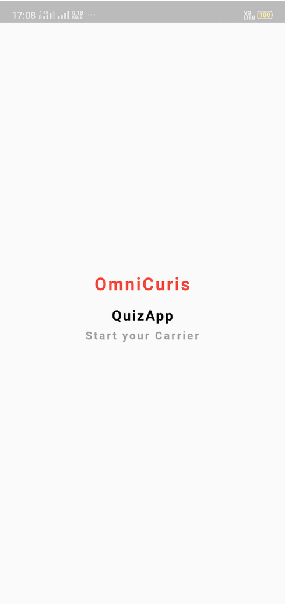
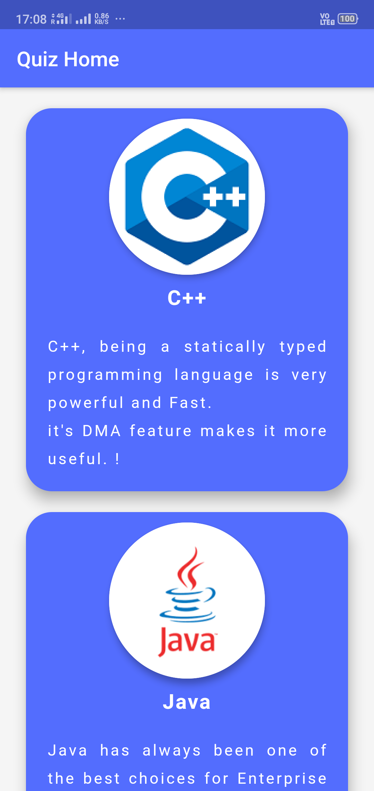
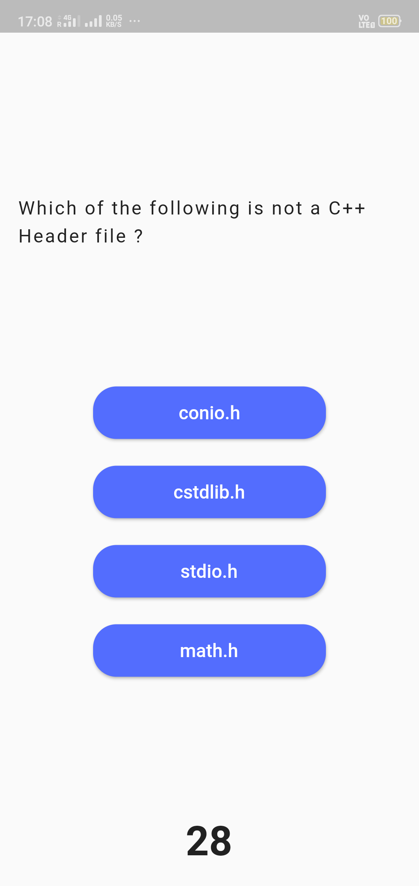
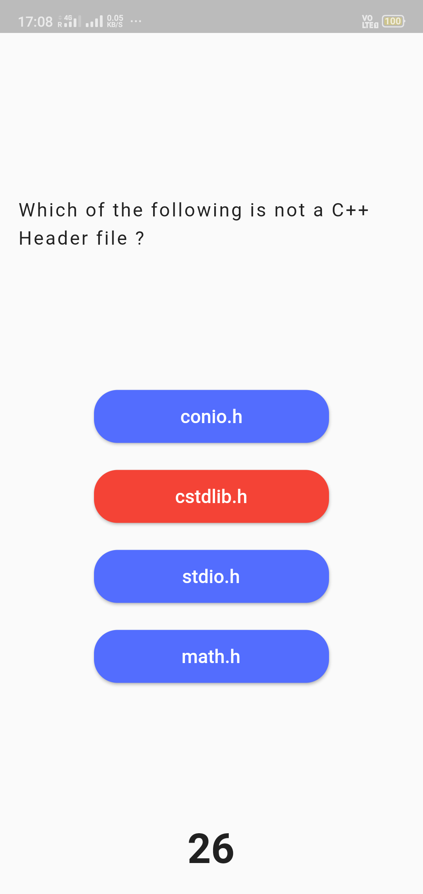

# QuizApp

steps :
1) clone the code
2) cd quizapp
3) flutter pub get
4) modify the changes what ever you want
5) generate a apk using android Studio and Generate IPA by using XCODE in apple.

I hope this will helps you for initial kick start.

  

